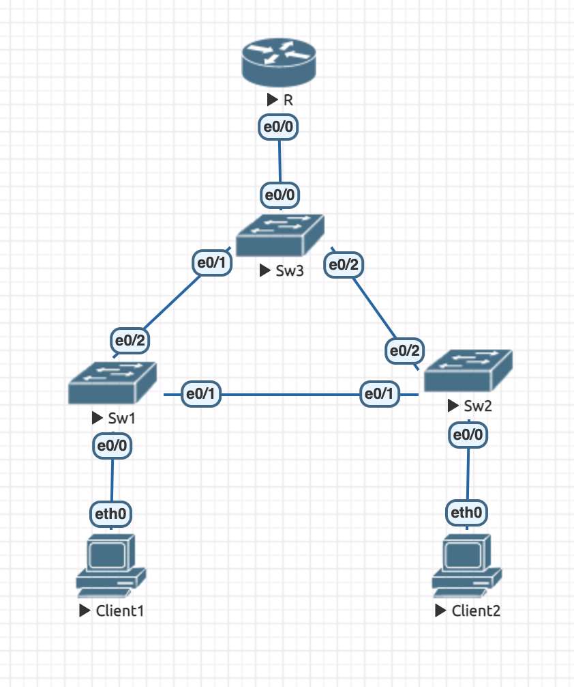
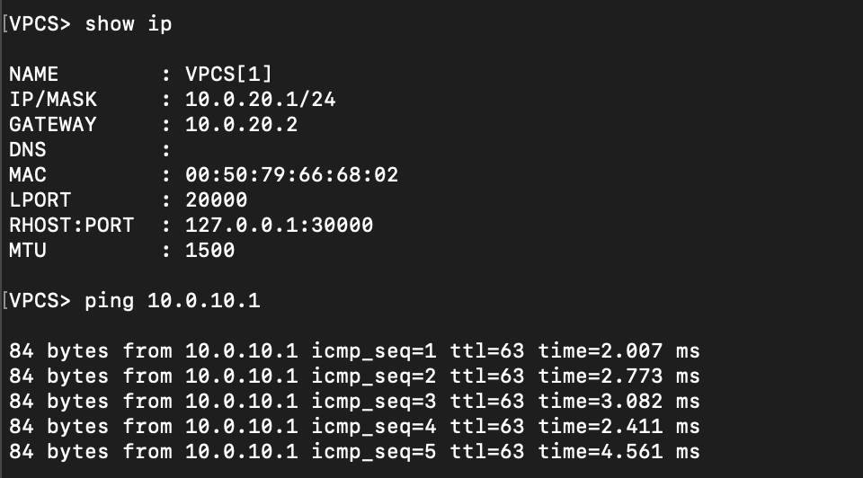
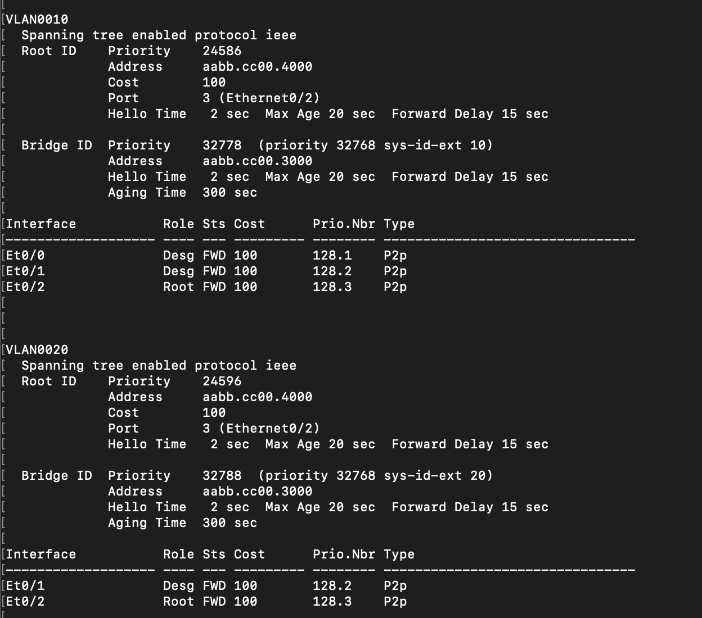
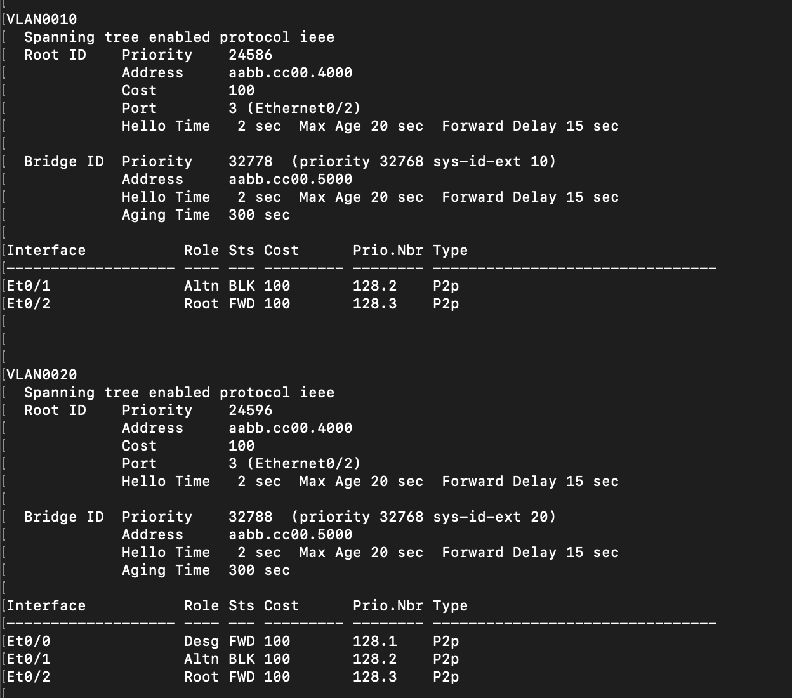
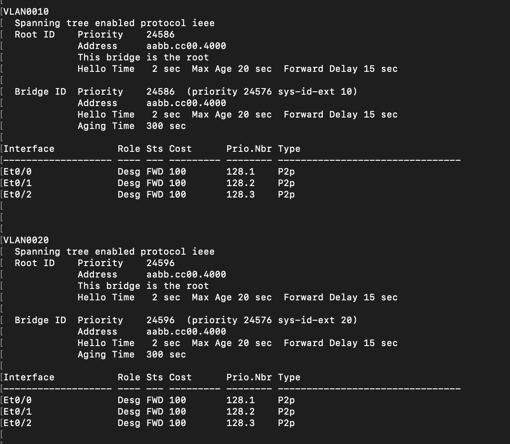

## 1. Сначала соберем топологию по схеме из задания (в EVE-NG):



## 2. Настроим конфиги для коммутаторов уровня доступ (Sw1, Sw2).

Для этого нужно в терминале для каждого свитча перейти в режим конфигурации, создать два VLAN (10 и 20).

Затем перейдем к конфигурированию интерфейсов. Портам, из которых выходят линки в хосты, установим состояние `access`, а портам c линками в коммутаторы - `trunk` (тк между коммутаторами мы хотим сделать возможной пересылку всех пакетов).

### Sw1

```
➜  ~ telnet 192.168.205.133 32771
Switch>enable
Switch#configure terminal
Switch(config)#vlan 10
Switch(config-vlan)#vlan 20
Switch(config-vlan)#exit

Switch(config)#interface e0/0
Switch(config-if)#switchport mode access
Switch(config-if)#switchport access vlan 10
Switch(config-if)#exit

Switch(config)#interface e0/1
Switch(config-if)#switchport trunk encapsulation dot1q 
Switch(config-if)#switchport mode trunk
Switch(config-if)#switchport trunk allowed vlan 10,20
Switch(config-if)#exit

Switch(config)#interface e0/2                      
Switch(config-if)#switchport trunk encapsulation dot1q
Switch(config-if)#switchport mode trunk               
Switch(config-if)#switchport trunk allowed vlan 10,20
Switch(config-if)#exit
Switch(config)#exit
Switch#write
```

### Sw2

```
➜  ~ telnet 192.168.205.133 32773
Switch>enable
Switch#configure terminal
Switch(config)#vlan 10
Switch(config-vlan)#vlan 20
Switch(config-vlan)#exit

Switch(config)#interface e0/0
Switch(config-if)#switchport mode access
Switch(config-if)#switchport access vlan 20
Switch(config-if)#exit

Switch(config)#interface e0/1
Switch(config-if)#switchport trunk encapsulation dot1q 
Switch(config-if)#switchport mode trunk
Switch(config-if)#switchport trunk allowed vlan 10,20
Switch(config-if)#exit

Switch(config)#interface e0/2                      
Switch(config-if)#switchport trunk encapsulation dot1q
Switch(config-if)#switchport mode trunk               
Switch(config-if)#switchport trunk allowed vlan 10,20
Switch(config-if)#exit
Switch(config)#exit
Switch#write
```

## 3. Настроим коммутатор уровня распределения (Sw3).

Для начала добавим VLAN-ы и установим всем интерфейсам состояние `trunk`.

```
➜  ~ telnet 192.168.205.133 32772
Switch>enable
Switch#configure terminal
Switch(config)#vlan 10
Switch(config-vlan)#vlan 20
Switch(config-vlan)#exit

Switch(config)#interface e0/0
Switch(config-if)#switchport trunk encapsulation dot1q 
Switch(config-if)#switchport mode trunk
Switch(config-if)#switchport trunk allowed vlan 10,20
Switch(config-if)#exit

Switch(config)#interface e0/1
Switch(config-if)#switchport trunk encapsulation dot1q 
Switch(config-if)#switchport mode trunk
Switch(config-if)#switchport trunk allowed vlan 10,20
Switch(config-if)#exit

Switch(config)#interface e0/2                      
Switch(config-if)#switchport trunk encapsulation dot1q
Switch(config-if)#switchport mode trunk               
Switch(config-if)#switchport trunk allowed vlan 10,20
Switch(config-if)#exit
Switch(config)#exit
```

Не забудем, что в сети нужно настроить протокол STP. Установим Sw3 корневым для обоих VLAN. Тогда линк между коммутаторами уровня доступ (Sw1, Sw2) заблокируется (по алгоритму протокола STP, аналогичная ситуация была рассмотрена на семинаре).

```
Switch#configure terminal                
Switch(config)#spanning-tree vlan 10,20 root primary
Switch(config)#exit
Switch#write
```

## 3. Настроим маршрутизатор (R).

Здесь нужно задать конфигурацию интерфейсу `e0/0` и прописать айпишники у подинтерфейсов `e0/0.10` и `e0/0.20`.

```
➜  ~ telnet 192.168.205.133 32774
Router>enable
Router#configure terminal

Router(config)#interface e0/0
Router(config-if)#no shutdown
Router(config-if)#exit

Router(config)#interface e0/0.10
Router(config-subif)#encapsulation dot1q 10
Router(config-subif)#ip address 10.0.10.2 255.255.255.0
Router(config-if)#exit

Router(config)#interface e0/0.20
Router(config-subif)#encapsulation dot1q 20            
Router(config-subif)#ip address 10.0.20.2 255.255.255.0
Router(config-subif)#exit
Router(config)#exit
Router#write
```

## 4. Настроим клиентов сети (Client1, Client2).

Осталось настроить клиентов. Тут все просто, нужно только задать айпишники.

### Client1

```
➜  ~ telnet 192.168.205.133 32769
VPCS> ip 10.0.10.1/24 10.0.10.2
VPCS> write
```

### Client2

```
➜  ~ telnet 192.168.205.133 32770
VPCS> ip 10.0.20.1/24 10.0.20.2
VPCS> write
```

## Проверка ping

### Client1


### Client2



## Проверка spanning-tree

### Sw1 



### Sw2



### Sw3



Заметим, что сеть действительно отказоустойчива благодаря "избыточности" линков между Sw1-Sw2-Sw3. При отключении одного из интерфейсов spanning-tree просто перестроится.
