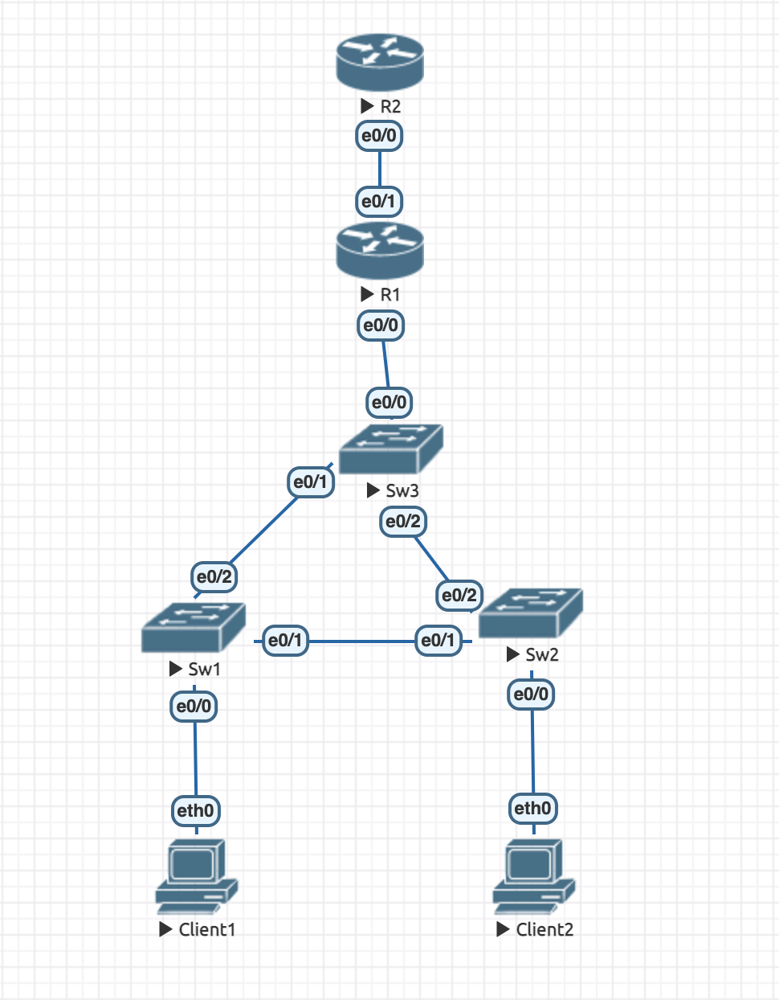

## 1. Добавим еще один маршрутизатор (R2) в EVE-NG.



## 2. Поправим конфиг маршрутизатора R1 (ранее назывался R):

Нужно настроить DHCP  (в том числе исключить первые 10 IP адреса из выдачи клиентам), поправить конфиги интерфейсов, добиться работы NAT для большого количества клиентов(>10) в каждой сети.

 ```
Router>enable
Router#configure terminal

Router(config)#ip dhcp pool gr10
Router(dhcp-config)#network 10.0.10.0 255.255.255.0
Router(dhcp-config)#default-router 10.0.10.1
Router(dhcp-config)#dns-server 8.8.8.8
Router(dhcp-config)#exit
Router(config)#ip dhcp excluded-address 10.0.10.0 10.0.10.10

Router(config)#ip dhcp pool gr20                            
Router(dhcp-config)#network 10.0.20.0 255.255.255.0              
Router(dhcp-config)#default-router 10.0.20.1     
Router(dhcp-config)#dns-server 8.8.8.8       
Router(dhcp-config)#exit
Router(config)#ip dhcp excluded-address 10.0.20.0 10.0.20.10

Router(config)#int e0/0
Router(config-if)#no shutdown
Router(config-if)#exit

Router(config)#int e0/0.10           
Router(config-subif)#no shutdown
Router(config-subif)#encapsulation dot1q 10
Router(config-subif)#ip address 10.0.10.1 255.255.255.0
Router(config-subif)#ip nat inside
Router(config-subif)#exit

Router(config)#int e0/0.20
Router(config-subif)#no shutdown                       
Router(config-subif)#encapsulation dot1q 20            
Router(config-subif)#ip address 10.0.20.1 255.255.255.0
Router(config-subif)#ip nat inside
Router(config-subif)#exit

Router(config)#int e0/1
Router(config-if)#no shutdown
Router(config-if)#ip address 10.0.0.5 255.255.255.0 
Router(config-if)#ip nat outside
Router(config-if)#exit

Router(config)#ip nat pool pool 10.0.0.5 10.0.0.255 netmask 255.255.255.0
Router(config)#access-list 10 permit ip 10.0.20.0 0.0.0.255 any
Router(config)#access-list 10 permit ip 10.0.10.0 0.0.0.255 any
Router(config)#ip nat inside source list 100 pool pool
Router(config)#exit
Router#write
 ```

### 3. Настройка нового маршрутизатора (R2).

```
Router>enable
Router#configure terminal
Router(config)#interface e0/0
Router(config-if)#no shutdown
Router(config-if)#ip address 10.0.0.1 255.255.255.0
Router(config-if)#exit
Router(config)#exit
Router#write
```

